<p align="center">
  
</p>

<h1 align="center">TRI-NETRA FORENSICS</h1>

<p align="center">
  <strong>Enterprise AI-Powered Financial & Telecom Investigation Workspace</strong>
</p>

<p align="center">
  
</p>
<p align="center">
  
  
  
  
  
  
</p>

---

## 🔍 Executive Summary

Cybercrimes and financial scams involve parsing mountains of raw data across different formats—thousands of rows of Bank Statements (Excel/PDF), Call Detail Records (CDR), and Internet Protocol Detail Records (IPDR). The decisive evidence usually lies at the intersection of these datasets: the exact moment a suspect was on a call, online from a particular IP, and transferring money. 

**Tri-Netra Forensics** automates the forensic data science workflow. It ingests multi-format records, normalizes them onto a canonical timeline, and runs a massive 11-model Machine Learning ensemble to detect money laundering, mule accounts, and structural anomalies.

---

## 💻 Tech Stack & Core Frameworks

Tri-Netra is built on a modern, high-performance web and data-science stack.

| Category | Technology | Description |
| :--- | :--- | :--- |
| **Frontend UI** |  **Next.js 16 (React 18)** | Server-side rendering (SSR), highly responsive interface routing, and utility-first styling with glassmorphism via **Tailwind CSS**. |
| **Visualizations** |  **Three.js** &nbsp;  **D3.js** | **Three.js & React Flow**: 2D and 3D force-directed layout engines for rendering complex communication and money-flow syndicates.<br>**D3.js**: SVG-based rendering for the interactive, multi-axis unified chronological timeline. |
| **Backend Core** |  **FastAPI** | High-throughput asynchronous REST APIs handling large concurrent data uploads, deployed via **Uvicorn / Gunicorn**. |
| **Data Science** |  **Pandas** <br>  **NumPy** | High-performance memory-mapped tabular data parsing and complex matrix vectorization. **pdfplumber** handles geometric PDF table extraction. |
| **Machine Learning**|  **Scikit-Learn** | Foundation for the massive 11-model Risk Ensemble (Isolation Forest, SVM, DBSCAN, Random Forest) analyzing behavioral metadata. |
| **Graph AI** |  **NetworkX** | In-memory graph processing to calculate centrality, circular flows, and layering hops in real-time. |
| **Infra & Data** |  **Docker & SQLite** | Containerized architecture for seamless local and cloud deployment. **SQLite JSON bundles** provide portable, highly-concurrent state management. |

---

## 🧠 11-Model Machine Learning & AI Ensemble

Rather than relying on a single algorithm, the Tri-Netra Risk Engine (`backend/risk/ensemble.py`) concurrently executes an **11-model hybrid ensemble** to evaluate behavioral anomalies, ensuring high-confidence alerts that evade simple deterministic rules.

### 🔵 Unsupervised Detectors — Cold Start (7 Models)

| | Model | Library | What it Detects |
|:---:|:---|:---|:---|
| 🌲 | **Isolation Forest** | `sklearn.ensemble` | Global shape deviations & structural outliers |
| 📍 | **Local Outlier Factor (LOF)** | `sklearn.neighbors` | Local density deviations vs. peer accounts |
| 🔵 | **DBSCAN** | `sklearn.cluster` | Dense behavioral clusters; flags noise points |
| 🔶 | **HDBSCAN** | `hdbscan` | Hierarchical density clustering for variable datasets |
| ⚡ | **One-Class SVM** | `sklearn.svm` | RBF-kernel margin outliers in feature space |
| 📐 | **PCA Reconstruction Error** | `sklearn.decomposition` | Accounts unrepresentable in the principal subspace |
| 📊 | **Z-Score Baseline** | `numpy` | Extreme-feature statistical thresholding |

### 🟠 Supervised Detectors — Ground Truth Mode (4 Models)

| | Model | Library | Specialization |
|:---:|:---|:---|:---|
| 🌳 | **Random Forest Classifier** | `sklearn.ensemble` | Non-linear ensemble tree voting on account features |
| ⚡ | **XGBoost** | `xgboost` | Gradient-boosted trees optimized for sparse financial data |
| 💡 | **LightGBM** | `lightgbm` | Histogram-based gradient boosting, high speed |
| 🐱 | **CatBoost** | `catboost` | Handles categorical telecom identifiers natively |

### 🤖 Generative AI Copilot

| | Model | Provider | Capability |
|:---:|:---|:---|:---|
| 🧠 | **Nemotron (Grounded RAG)** | `OpenRouter` | Translates natural language (EN/HI/GJ) → SQL/Graph queries with zero hallucination |


---

## 👮 Real-Life Investigation Workflow

From the investigator's perspective, the workflow is streamlined:

1. **01 — Collect Evidence**: Gather Bank, CDR, IPDR, and related records from providers.
2. **02 — Ingest**: Drop files into the platform. The system automatically detects the schema (Jio, Airtel, SBI, HDFC).
3. **03 — Normalize**: Standardizes identifiers (phones, IPs, accounts) and timestamps.
4. **04 — Fuse**: Connects related records across domains via shared attributes (e.g., UPI IDs linked to phones).
5. **05 — Analyze**: Applies the 11-model ensemble and deterministic rules.
6. **06 — Investigate**: Utilize Fused Transactions, Anomalies, Timeline, Entity Search, Network Graphs, and the AI Copilot.
7. **07 — Report**: Generate final forensic dossiers and automated Suspicious Transaction Reports (STR).

---

## 📸 Platform Walkthrough

### Investigation Command Center
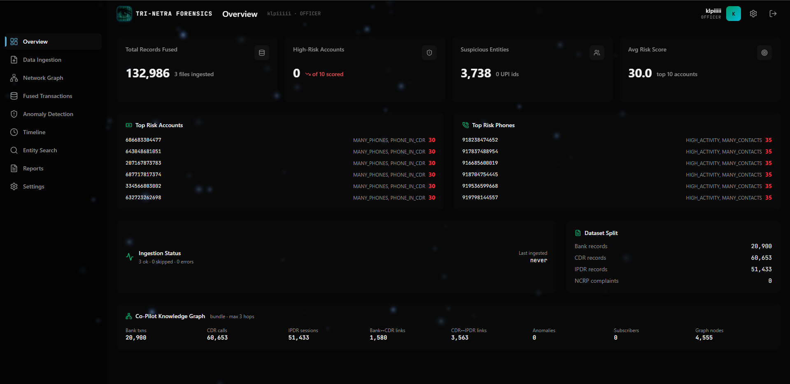
<em>Command Center displaying node ingestion metrics, high-risk flags, and live model confidence.</em>

### Cross-Domain Evidence Ingestion
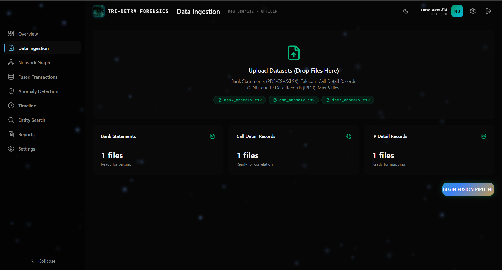
<em>Multi-format drag-and-drop ingestion interface supporting heterogeneous logs.</em>

### Cross-Dataset Fusion & Timeline
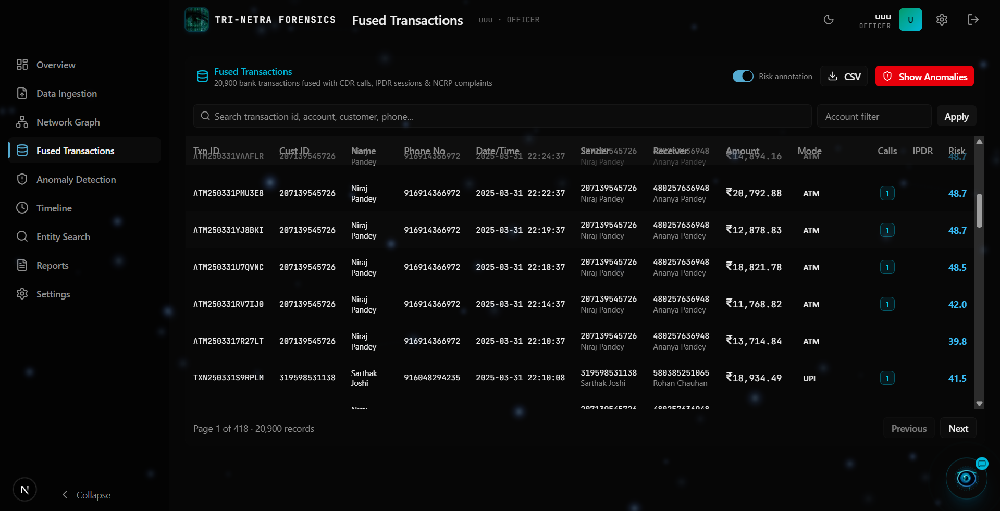
<em>Fused Transactions showing unified activity across previously isolated datasets.</em>

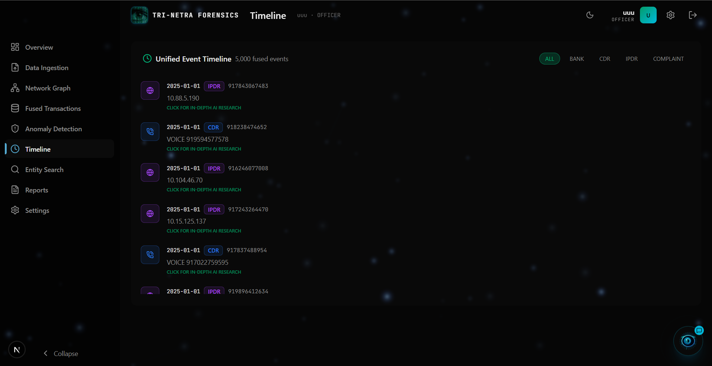
<em>Unified Timeline overlaying call events, IP sessions, and financial transactions simultaneously.</em>

### Network & Syndicate Intelligence
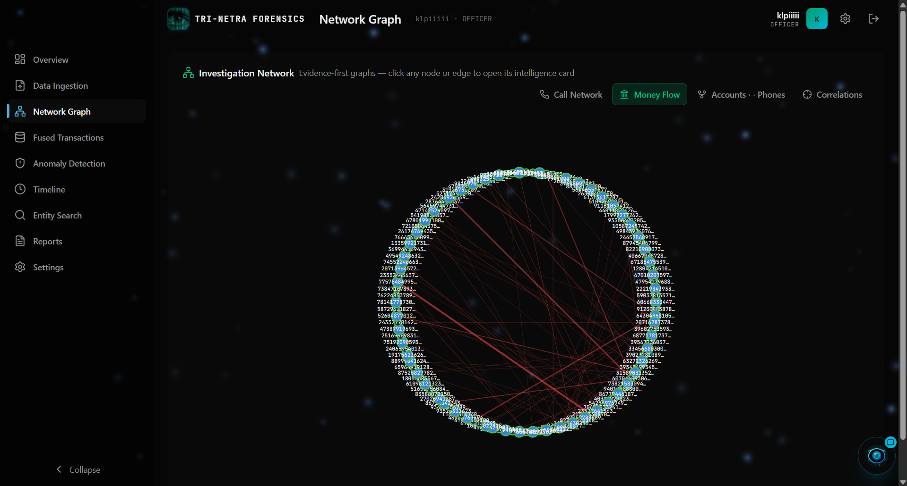
<em>Money Flow topology tracking laundering hops and intermediary mule accounts.</em>

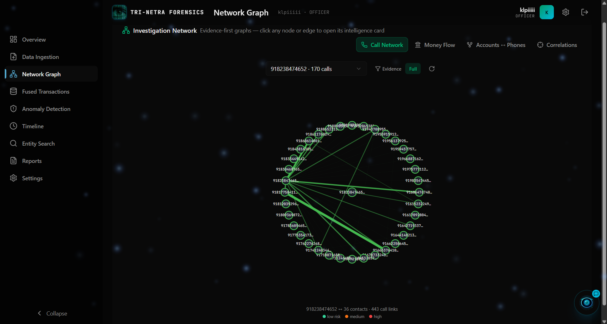
<em>Communication Network mapping interactions between suspect phone numbers.</em>

### Anomaly Feed & AI Profiling
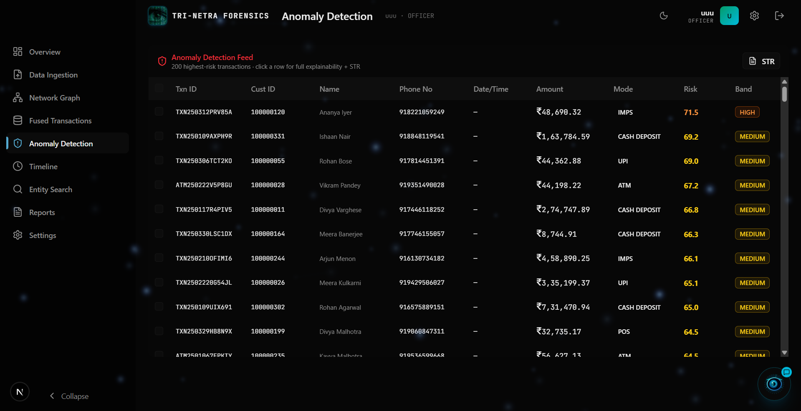
<em>Anomaly Feed detailing multi-stage risk orchestration alerts generated by the ML ensemble.</em>

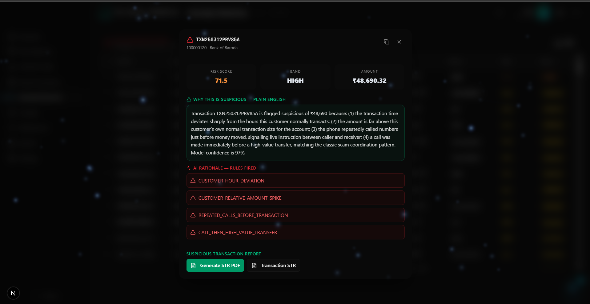
<em>Transaction Intelligence Card providing deep-dive context into a specific high-risk flag.</em>

### Autonomous Investigative Copilot
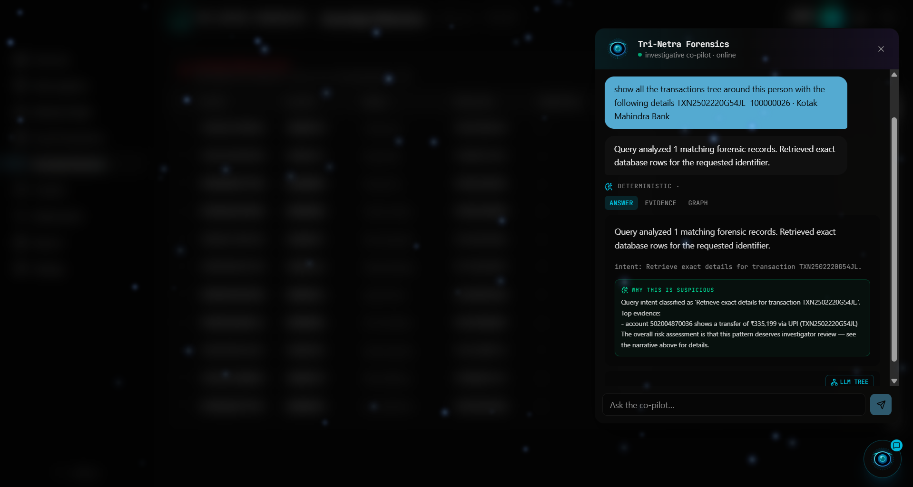
<em>Natural language RAG queries grounded in case data returning evidence-backed answers.</em>

### 3D LLM Semantic Graph (USP)
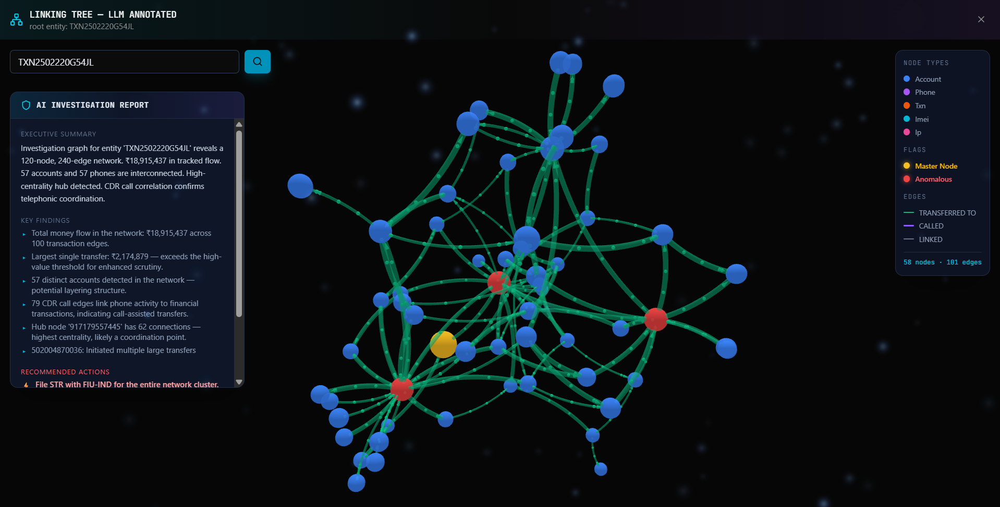
<em>Interactive 3D Semantic Tree visualizing anomalous entities, branches, and master nodes generated dynamically by the LLM.</em>

### STR Generation & Forensic Reporting
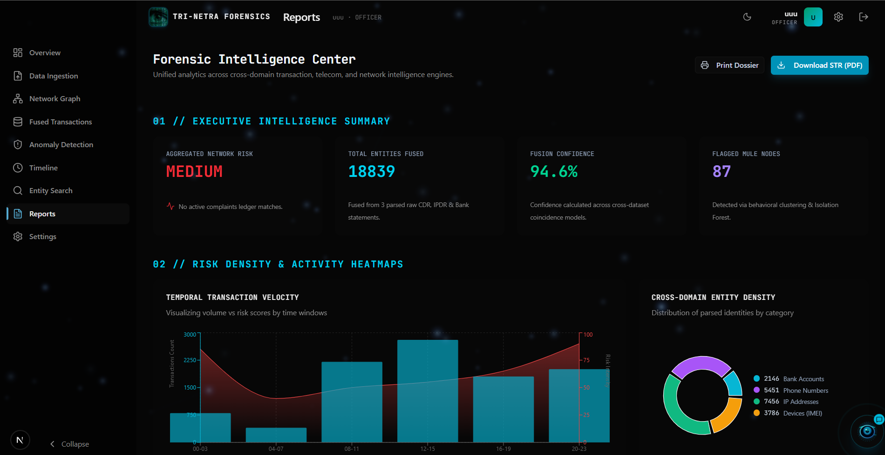
<em>One-click court-ready case dossier and Suspicious Transaction Report (STR) generator.</em>

---

## 🏛️ Pipeline Architecture

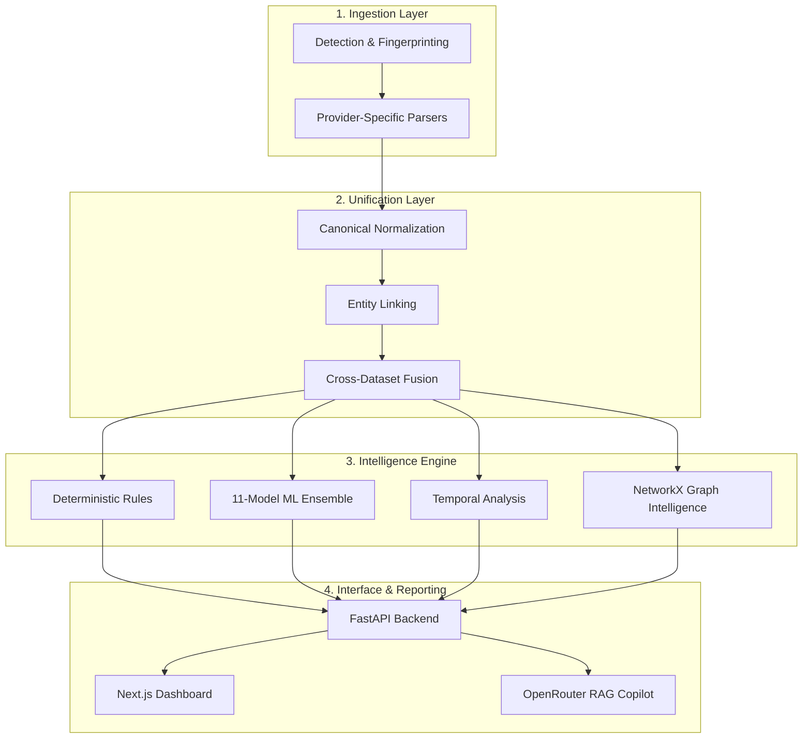

---

## 📖 Deep-Dive Documentation

For an in-depth understanding of the platform's inner workings, refer to the documentation:

* [Architecture Overview](docs/architecture.md)
* [API Reference](docs/api.md)
* [Data & Entity Model](docs/data-model.md)
* [Parsers Ecosystem](docs/parsers.md)
* [Canonical Normalization](docs/normalization.md)
* [Cross-Dataset Fusion](docs/fusion.md)
* [Risk Engine (Rules + ML)](docs/risk-engine.md)
* [AI Copilot Architecture](docs/copilot.md)
* [Database & Storage](docs/database.md)
* [Deployment Guide](docs/deployment.md)
* [Attribution & Third-Party Libraries](docs/attribution.md)
* [Requirements Traceability Matrix](docs/requirements-matrix.md)
* [Troubleshooting](docs/troubleshooting.md)

---

## 🚀 Quick Start & Evaluator Walkthrough

### Prerequisites
* **Python**: 3.11+
* **Node.js**: 18.x+ (Next.js 16)

### 1. Start the Backend
```bash
cd backend
pip install -r requirements.txt
uvicorn main:app --reload --port 10000
```

### 2. Start the Frontend
```bash
cd frontend
npm install
npm run dev
```

### Quick Evaluation Walkthrough
1. **Launch**: Open `http://localhost:3000`.
2. **Login**: Authenticate (Default: admin/admin).
3. **Upload Evidence**: Drag and drop Bank + CDR + IPDR files from the `data/` directory.
4. **Inspect Pipeline**: Watch the status as the files are parsed, normalized, and fused.
5. **Explore Network Graph**: Visualize money flows and communication.
6. **Open Anomalies**: Review the flagged transactions based on the ML ensemble.
7. **Ask Copilot**: Query the data in natural language (e.g. "Who did suspect X call before the transaction?").
8. **View STR**: Inspect the Suspicious Transaction Report.

For detailed Docker or production setup, see [docs/deployment.md](docs/deployment.md).

---

## 📄 License & Attribution

Distributed under the MIT License. See [docs/attribution.md](docs/attribution.md) for details on third-party libraries, external APIs (OpenRouter), UI libraries, and custom code distinction.
