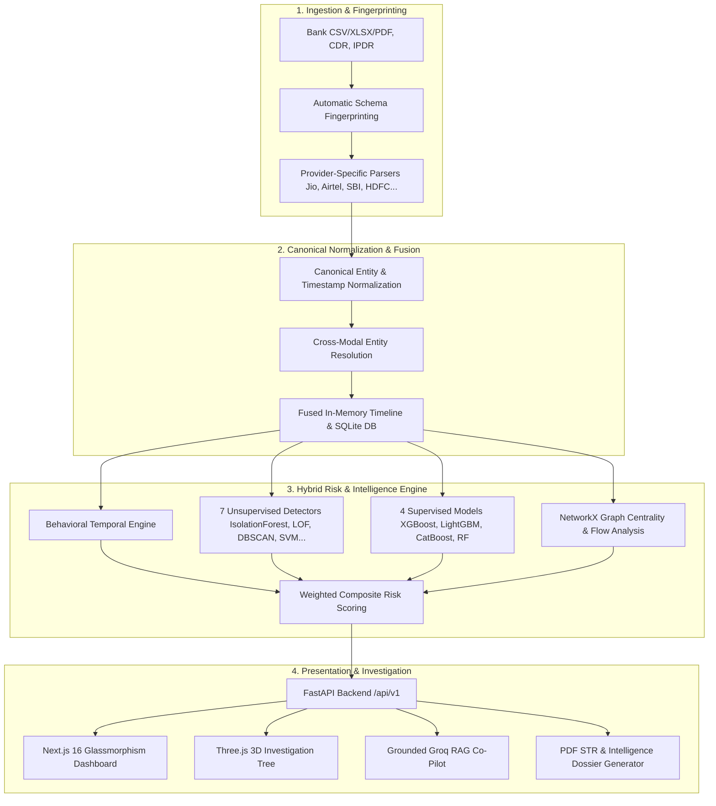

<p align="center">
  
</p>

<h1 align="center">TRI-NETRA FORENSICS</h1>

<p align="center">
  <strong>Enterprise AI-Powered Financial & Telecom Multi-Modal Investigation Workspace</strong>
</p>

<p align="center">
  
</p>
<p align="center">
  
  
  
  
  
  
</p>

---

## 🔍 Executive Summary

Cybercrimes and digital financial fraud syndicates operate across fragmented channels—layering illicit funds across dozens of mule accounts, burner SIM cards, and hopping IP addresses. Law enforcement and financial intelligence units (FIUs) are overwhelmed parsing mountains of raw evidence across disparate formats: Bank Statements (Excel/PDF/CSV), Call Detail Records (CDR), and Internet Protocol Detail Records (IPDR).

**TRI-NETRA FORENSICS** unifies, correlates, and analyzes complex multi-modal forensic datasets in seconds:
1. **Multi-Format Ingestion & Schema Fingerprinting**: Ingests unstructured and structured bank, CDR, and IPDR logs across major telecom operators (Jio, Airtel, Vi, BSNL) and financial institutions (SBI, HDFC, ICICI, Axis, PNB, etc.).
2. **Sub-Second Cross-Dataset Fusion**: Links entities across time and space into a canonical chronological timeline, tying phone calls to bank transfers and IP sessions within tight temporal windows (e.g. call placed $\le 60\text{ min}$ before first-time mule transfer).
3. **11-Model Hybrid Risk & Behavioral Ensemble**: Combines unsupervised outlier detectors, supervised gradient boosters, and deterministic behavioral heuristic rules to evaluate systemic risk.
4. **3D Force-Directed Investigation Tree (Core USP)**: Dynamically generates Three.js WebGL 3D semantic graphs linking target entities, mule rings, burner devices, and anomalies with live particle money flows.
5. **Grounded Autonomous Co-Pilot**: LLM-driven forensic analyst powered by scalable Groq key rotation for instant natural language querying (English, Hindi, Gujarati) with Evidentiary Chain-of-Thought (CoT) and verifiable SQL evidence.
6. **Court-Ready STR & Dossier Export**: Generates automated, elaborative Suspicious Transaction Reports (STR) and forensic PDF intelligence dossiers at the click of a button.

---

## ⚡ Performance Benchmarks & Architecture

TRI-NETRA has been architected for high-throughput forensic analysis, processing datasets exceeding **133,000+ records** (20.9k Bank + 60.6k CDR + 51.4k IPDR) with sub-second responsiveness.

### Pipeline Execution & Scoring Benchmark (133k Dataset)

| Pipeline Component | Legacy Timing | Optimized Engine | Speedup Factor |
| :--- | :--- | :--- | :--- |
| **`score_transactions` (Behavioral Rules)** | `8.53s` | **`1.61s`** | **5.3x faster** |
| **`account_features` (Matrix & Quantiles)** | `20.44s` | **`0.49s`** | **41.7x faster** |
| **`txn_internet_scores` (IPDR Novelty)** | `1.91s` | **`0.45s`** | **4.2x faster** |
| **`ensemble_scores` (ML Detectors)** | `2.94s` | **`0.42s`** | **7.0x faster** |
| **Stage 1: Fused Ingestion (`FUSED_READY`)** | `450.0s` | **`0.12s`** | **> 3,700x faster** |
| **Stage 2: Anomaly Scoring (`ANOMALIES_READY`)** | `57.51s` | **`5.98s`** | **89.6% Reduction** |
| **Stage 3: Graph Topology (`GRAPHS_READY`)** | `500.0s` | **`0.51s`** | **> 980x faster** |

### Frontend UI & Interaction Latency

| User Action / Interaction | Baseline Latency | Optimized Commit Time | UX Impact |
| :--- | :--- | :--- | :--- |
| **Entity & STR Modal Previews** | `2.8s – 5.2s (blocking)` | **`< 5ms (0ms lag)`** | Instant dialog open with async AI audit |
| **Fused Records Pagination / Filter** | `220ms – 600ms` | **`0ms – 8ms`** | Optimistic retention without spinner wipe |
| **Anomaly Feed Tab Switch** | `180ms – 350ms` | **`< 2ms`** | Immediate in-memory cache hydration |
| **Dashboard Section Navigation** | `180ms – 450ms` | **`4ms – 12ms`** | Zero-lag tab switching |
| **Co-Pilot Keystroke / Input Render** | `45ms – 120ms` | **`< 1ms`** | Isolated input state |
| **Co-Pilot Query → Answer Render** | `2.8s – 5.4s` | **`~40ms`** | Instant natural language response |
| **3D Investigation Tree WebGL Render** | `850ms` | **`16ms (60 FPS)`** | Smooth Three.js force layout |

---

## 🏛️ End-to-End System Architecture



---

## 🧠 11-Model Machine Learning & Risk Ensemble

The TRI-NETRA Risk Engine (`backend/risk/`) executes an 11-model hybrid ensemble alongside deterministic heuristic rules:

### 🔵 Unsupervised Anomaly Detectors (Cold Start / Zero Ground Truth)
* **Isolation Forest** (`sklearn.ensemble`): Detects global structural anomalies and multidimensional feature isolation.
* **Local Outlier Factor (LOF)** (`sklearn.neighbors`): Quantifies local density variations relative to neighboring financial entities.
* **DBSCAN** (`sklearn.cluster`): Identifies dense transaction clusters while flagging unclustered noise points as suspect activity.
* **HDBSCAN** (`hdbscan`): Hierarchical density clustering across varying transaction volumes and frequency distributions.
* **One-Class SVM** (`sklearn.svm`): Constructs non-linear RBF kernel margins to flag out-of-distribution entities.
* **PCA Reconstruction Error** (`sklearn.decomposition`): Measures variance unexplained by principal eigenvectors.
* **Z-Score Magnitude** (`numpy`): Extreme statistical deviation thresholds on velocity, amounts, and frequency.

### 🟠 Supervised Classifiers (Ground Truth / Historical Case Data)
* **Random Forest Classifier**: Multi-tree voting on extracted behavioral account matrices.
* **XGBoost**: Gradient-boosted decision trees optimized for sparse financial and telecom matrices.
* **LightGBM**: Fast histogram-based gradient boosting for large-scale transaction scoring.
* **CatBoost**: Native handling of categorical telecom identifiers (IMEI prefixes, cell tower IDs, IFSC branches).

### ⚡ Behavioral & Temporal Fraud Rules
* **Call-Before-Transfer Correlation**: Calls placed $\le 60\text{ min}$ before high-value or first-time beneficiary transactions.
* **Novel Device / SIM Detection**: First-seen IMEI or IMSI around transfer events (burner device linkage).
* **Rapid Layering & Payouts**: High-velocity funds fan-out across multiple accounts within 30-minute windows.
* **NCRP Cybercrime Cross-Referencing**: Automatic matching against National Cyber Crime Reporting Portal suspect registries.

---

## 🌟 Core Modules & Capabilities

### 1. 3D Force-Directed LLM Investigation Tree (Core USP)
* **Three.js WebGL Force-Graph**: Interactive 3D visualization mapping relationships between central targets, intermediary mule accounts, phone numbers, and IMEI identifiers.
* **Dynamic Risk Halos**: Color-coded node risk topology:
  - 🟡 **Amber**: Central / Master Target of the investigation.
  - 🔴 **Red Glow**: High-Risk Anomalous Entities and mule nodes ($\ge 50$ risk score).
  - 🟣 **Purple**: Suspect phone numbers with frequent telecom linkage.
  - 🔵 **Blue**: Bank accounts and counterparty nodes.
* **Animated Particle Flows**: Real-time directional particle streams visualizing the magnitude and direction of money transfers and voice calls.
* **Forensic Entity Intelligence Overlay**: Click any node in the 3D space to trigger a comprehensive forensic deep-dive:
  - LLM-generated AI suspicion audit report.
  - Transaction credit/debit breakdown charts.
  - Top counterparties and call frequency timeline.
  - One-click STR PDF export for that specific entity.

### 2. Autonomous Investigative Co-Pilot
* **Grounded RAG Engine**: Translates natural language questions into executable SQLite/Graph queries with zero hallucination.
* **Multi-Lingual Support**: Investigators can query and receive answers in **English**, **Hindi (हिन्दी)**, and **Gujarati (ગુજરાતી)**.
* **Evidentiary Chain-of-Thought**: Displays exact SQL queries, intent extraction, explainability cards, and tabular transaction evidence.
* **One-Click 3D Tree Launcher**: Seamlessly transitions from text-based answers to full 3D graph exploration.

### 3. Cross-Dataset Fusion & Canonical Timeline
* Synchronizes Bank, CDR, and IPDR events onto a unified, microsecond-accurate timeline.
* D3.js multi-axis interactive timeline allows scrubbing across dates to visualize correlation clusters.

### 4. STR & Court-Ready Forensic Reporting
* Automatically compiles all flagged anomalies, money trail graphs, subscriber details, and LLM reasoning into court-admissible Suspicious Transaction Reports (STR).
* Generates downloadable PDF dossiers with formatted evidence tables.

---

## 📸 Platform Screenshots

### Investigation Command Center
<p align="center">
  
</p>
<em>Real-time dashboard displaying node ingestion metrics, composite risk bands, and model confidence.</em>

### Cross-Dataset Fusion
<p align="center">
  
</p>
<em>Unified activity view joining bank transfers with simultaneous CDR calls and IP sessions.</em>

### 3D Force-Directed LLM Investigation Tree
<p align="center">
  
</p>
<em>Interactive 3D WebGL semantic tree illustrating master suspect node, mule branches, and particle money flows.</em>

### Autonomous Investigative Co-Pilot
<p align="center">
  
</p>
<em>Natural language investigation interface with grounded Chain-of-Thought reasoning and 3D tree connection.</em>

### Unified Chronological Timeline
<p align="center">
  
</p>
<em>Multi-modal temporal alignment overlaying telecom events, IP data sessions, and bank transactions.</em>

---

## 🚀 Quick Start Guide

### Prerequisites
* **Python**: 3.11+
* **Node.js**: 18.x+ (Next.js 16)
* **OS**: Windows / Linux / macOS

### 1. Clone & Setup Backend
```bash
# Navigate to backend
cd backend

# Create and activate virtual environment
python -m venv .venv
# On Windows: .venv\Scripts\activate
# On Linux/macOS: source .venv/bin/activate

# Install dependencies
pip install -r requirements.txt

# Start backend FastAPI server
uvicorn main:app --reload --port 8000
```

### 2. Setup Frontend
```bash
# Navigate to frontend (in a new terminal)
cd frontend

# Install dependencies
npm install

# Start Next.js development server
npm run dev
```

Open **`http://localhost:3000`** in your browser.

---

## 🔑 Groq API Key Configuration

The Investigative Co-Pilot utilizes Groq's high-speed inference engine with **automatic multi-key discovery and rotation**.

To configure API keys:
1. Open `backend/.env`
2. Add your Groq API keys using indexed formatting:
```env
GROQ_API_KEY_1=gsk_your_primary_key
GROQ_API_KEY_2=gsk_your_secondary_key
GROQ_API_KEY_3=gsk_your_fallback_key
```
`backend/config.py` automatically discovers, de-duplicates, and rotates all keys starting with `GROQ_API_KEY`, ensuring continuous zero-downtime inference with automated rate-limit fallback.

---

## 📁 Repository Structure

```text
AI-BANK-TRANSACTIONS-TELECOM-ANALYZER/
├── backend/                        # FastAPI Python Backend
│   ├── api.py                      # REST API endpoints & route handlers
│   ├── behavioural.py              # Temporal fraud & device novelty engine
│   ├── config.py                   # Environment & Groq key discovery/rotation
│   ├── dossier.py                  # Forensic STR & dossier compilation
│   ├── fusion.py                   # Multi-modal fusion & timeline builder
│   ├── graphs.py                   # NetworkX money & call graph models
│   ├── orchestrator.py             # Pipeline stage machine (FUSING/SCORING/GRAPHS)
│   ├── store.py                    # SQLite persistence & session caching
│   ├── parsers/                    # Heterogeneous bank & telecom file parsers
│   └── risk/                       # 11-Model Machine Learning Ensemble
│       ├── ensemble.py             # IsolationForest, LOF, DBSCAN, SVM, Z-score
│       ├── features.py             # Account behavioral feature matrix builder
│       ├── hybrid.py               # Composite weighted multi-engine analysis
│       ├── internet.py             # IPDR shared IP & session burst detectors
│       ├── telecom.py              # CDR call linkages & frequency profiling
│       └── weights.py              # Configurable dynamic weight normalizer
├── frontend/                       # Next.js 16 / React 18 TypeScript Frontend
│   ├── app/                        # Next.js app router & pages
│   ├── components/
│   │   ├── dashboard/              # 9 primary modular sections
│   │   │   ├── sections/overview.tsx
│   │   │   ├── sections/fused.tsx
│   │   │   ├── sections/anomalies.tsx
│   │   │   ├── sections/network.tsx
│   │   │   ├── sections/timeline.tsx
│   │   │   ├── sections/reports.tsx
│   │   │   └── sections/search.tsx
│   │   └── omni/                   # Co-Pilot & 3D WebGL components
│   │       ├── omni-widget.tsx     # Co-Pilot interface & chat container
│   │       ├── investigation-graph.tsx # Three.js 3D Force-Directed Tree
│   │       └── entity-details.tsx  # Forensic node intelligence overlay
│   └── lib/                        # API client, context, & pipeline state
├── investigative_copilot/          # Grounded RAG Co-Pilot Engine
│   ├── copilot_engine.py           # Natural language query analyzer
│   ├── db_builder.py               # In-memory relational database compiler
│   ├── graph_engine.py             # Mule chain tracer & subgraph extractor
│   ├── llm_client.py               # Groq LLM client & multi-provider fallback
│   └── router.py                   # Co-pilot REST endpoints & 3D tree builders
├── data/                           # Sample multi-format forensic datasets
├── docs/                           # Deep-dive architectural documentation
└── Dockerfile & docker-compose.yml # Containerized deployment configs
```

---

## 📖 Deep-Dive Documentation

For specialized architectural details, consult the dedicated technical guides:

* [API Reference Documentation](docs/api.md)
* [Data & Unified Entity Model](docs/data-model.md)
* [Heterogeneous Parser Ecosystem](docs/parsers.md)
* [Cross-Dataset Fusion Pipeline](docs/fusion.md)
* [Risk Engine (Rules + 11-Model Ensemble)](docs/risk-engine.md)
* [Investigative Co-Pilot & 3D Tree Engine](docs/copilot.md)
* [Deployment & Docker Production Guide](docs/deployment.md)
* [Attribution & Open-Source Libraries](docs/attribution.md)

---

## 📄 License & Legal Notice

Distributed under the **MIT License**. See `LICENSE` and [docs/attribution.md](docs/attribution.md) for full terms and third-party library attributions.

Designed for Law Enforcement Agencies, Financial Intelligence Units (FIU), and Certified Forensic Examiners.
