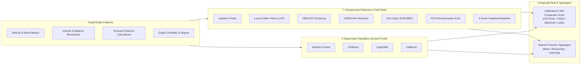
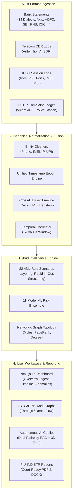

<p align="center">
  
</p>

<h1 align="center">TRI-NETRA FORENSICS</h1>

<p align="center">
  <strong>Enterprise AI-Powered Financial & Telecom Investigation Workspace</strong><br>
  <em>Next-Generation Fusion & Anomaly Detection for Bank Statements, CDR, and IPDR Data</em>
</p>

<p align="center">
  
</p>
<p align="center">
  
  
  
  
  
  
</p>

---

## 🔍 Executive Summary

Cyber-financial crimes and syndicates operate across fragmented channels—scattering evidence across bank statements (PDF/Excel), Call Detail Records (CDR), and Internet Protocol Detail Records (IPDR). The critical forensic breakthrough lies at the intersection: **the exact moment a suspect communicates with a target, logs into an IP session, and moves illicit funds**.

**Tri-Netra Forensics** solves **ERH26_PS_03** by automating the entire forensic data science workflow:
1. **Heterogeneous Ingestion**: Automatically detects and parses 14 Indian banking layout dialects (PDF/Excel/CSV), telecom CDRs (Airtel, Jio, Vi, SDR), IPDR session logs, and NCRP cybercrime complaints.
2. **Canonical Fusion**: Maps entities (accounts, phones, IMEIs, IMSIs, IPs, UPI handles) onto a unified chronological timeline with temporal coincidence correlation ($\pm 3600\text{s}$).
3. **11-Model Machine Learning Ensemble**: Concurrently executes 7 unsupervised anomaly detectors and 4 supervised classifiers alongside 22 deterministic typology checks (Rapid In-Out, Structuring, Mule Rings, Circular Flows, Call-Assisted Fraud).
4. **Graph & Syndicate Intelligence**: Visualizes complex 2D and 3D network topologies, money laundering hops, and caller-subscriber communities.
5. **Grounded AI Copilot**: Multi-lingual (English/Hindi/Gujarati) RAG assistant with Groq/OpenRouter multi-key rotation and an interactive 3D semantic reasoning tree.
6. **FIU-IND STR Generation**: Generates court-admissible forensic dossiers and regulatory Suspicious Transaction Reports in PDF and DOCX formats with a single click.

---

## 💻 Tech Stack & Architecture

| Layer | Technologies | Description |
| :--- | :--- | :--- |
| **Frontend UI** | **Next.js 16 (React 18)**, **TypeScript**, **Tailwind CSS** | Ultra-responsive SSR interface with dark-mode glassmorphic aesthetics, real-time pipeline status polling, and modular investigation views. |
| **Visualizations** | **Three.js**, **D3.js**, **React Flow** | **Three.js**: 3D force-directed money-flow topologies and 3D semantic copilot reasoning trees.<br>**D3.js**: High-density interactive chronological timeline.<br>**React Flow**: Node-based transaction graph exploration. |
| **Backend API** | **Python 3.11+**, **FastAPI**, **Uvicorn / Gunicorn** | High-throughput asynchronous REST backend with JWT authentication, multi-threaded parsing, and streaming responses. |
| **Data Science** | **Pandas**, **NumPy**, **pdfplumber**, **OpenPyXL** | Geometric table extraction from bank statements, vector-matrix operations, and robust CSV/XLSX normalizers. |
| **Machine Learning** | **Scikit-Learn**, **XGBoost**, **LightGBM**, **CatBoost**, **HDBSCAN** | 11-model hybrid risk ensemble calculating multidimensional anomaly scores and legal AML typologies. |
| **Graph AI** | **NetworkX** | Directed multigraph computation: PageRank, betweenness centrality, degree distribution, and circular flow cycles. |
| **Generative AI** | **Groq API**, **OpenRouter**, **NVIDIA Nemotron**, **Llama 3.3 70B** | Dual-pathway grounded RAG with zero hallucination, automated multi-key rotation, and read-only SQL execution. |
| **Database & Cache** | **SQLite (In-Memory + File)** | Ephemeral and persistent session databases, fast memory-mapped JSON bundles, and thread-safe caches. |

---

## 🧠 11-Model Machine Learning & Risk Ensemble

Rather than relying on a single algorithm, the Tri-Netra Risk Engine (`backend/risk/ensemble.py`) concurrently executes an **11-model hybrid ensemble** to evaluate behavioral anomalies:



### 🔵 Unsupervised Detectors (7 Models — Zero Labeled Data Needed)
| Icon | Model | Library | Forensic Detection Specialty |
|:---:|:---|:---|:---|
| 🌲 | **Isolation Forest** | `sklearn.ensemble` | Global structural volume outliers and transaction velocity spikes |
| 📍 | **Local Outlier Factor (LOF)** | `sklearn.neighbors` | Local density deviations against peer cluster distributions |
| 🔵 | **DBSCAN** | `sklearn.cluster` | Dense normal behavioral clusters; flags isolated noise transactions |
| 🔶 | **HDBSCAN** | `hdbscan` | Hierarchical density clustering across variable log densities |
| ⚡ | **One-Class SVM** | `sklearn.svm` | RBF-kernel nonlinear boundary margin outliers |
| 📐 | **PCA Reconstruction Error** | `sklearn.decomposition` | Accounts unrepresentable in the principal linear subspace |
| 📊 | **Z-Score Baseline** | `numpy` | Extreme statistical thresholding on amounts and frequency |

### 🟠 Supervised Detectors (4 Models — Active Benchmarking Mode)
| Icon | Model | Library | Specialization |
|:---:|:---|:---|:---|
| 🌳 | **Random Forest Classifier** | `sklearn.ensemble` | Non-linear ensemble tree voting on account features |
| ⚡ | **XGBoost** | `xgboost` | Gradient-boosted decision trees optimized for sparse financial features |
| 💡 | **LightGBM** | `lightgbm` | Fast histogram-based gradient boosting for large-scale transaction logs |
| 🐱 | **CatBoost** | `catboost` | Native categorical handling for telecom carrier and IFSC features |

---

## 🏛️ End-to-End Pipeline Architecture



---

## 📸 Platform Walkthrough & Feature Showcase

### 1. Investigation Command Center

<em>Unified command dashboard displaying total parsed nodes, active risk flags, and real-time model confidence.</em>

### 2. Cross-Domain Evidence Ingestion

<em>Multi-format drag-and-drop ingestion interface supporting heterogeneous files with automated schema detection.</em>

### 3. Fused Transactions & Unified Chronological Timeline

<em>Cross-dataset fused event log mapping financial transactions directly alongside suspect telecom communications.</em>


<em>Unified interactive D3.js timeline overlaying calls, SMS, IP sessions, and transfers simultaneously.</em>

### 4. 2D & 3D Network & Syndicate Intelligence

<em>Directed money flow topology tracking laundering hops, intermediary mule accounts, and circular flow rings.</em>


<em>Telecom communication network mapping interactions and subscriber communities between suspect numbers.</em>

### 5. Anomaly Feed & ML Risk Profiling

<em>Anomaly Feed detailing multi-stage risk alerts generated concurrently by the 11-model ML ensemble.</em>


<em>Deep-dive transaction card providing exact component breakdown, mathematical scores, and red flags.</em>

### 6. Autonomous Investigative Copilot (Grounded RAG)

<em>Natural language queries (English/Hindi/Gujarati) grounded in case data returning evidence-backed answers with zero hallucination.</em>

### 7. 3D LLM Semantic Reasoning Tree (USP)

<em>Interactive 3D WebGL semantic tree visualizing anomalous entities, reasoning branches, and corroborating evidence nodes.</em>

### 8. Automated FIU-IND STR Generation & Reporting

<em>One-click generation of court-ready forensic dossiers and official FIU-IND Suspicious Transaction Reports (STR).</em>

---

## 📖 Deep-Dive Technical Documentation

Every subsystem of Tri-Netra Forensics is thoroughly documented with architecture blueprints, API schemas, and mathematical specifications:

| Document | Description |
| :--- | :--- |
| 📘 **[System Architecture Blueprint](docs/architecture.md)** | End-to-end multi-tier architectural specifications, data flow, and security models. |
| 🔌 **[REST API Reference](docs/api.md)** | Full FastAPI endpoint documentation, request/response models, and auth contexts. |
| 🗄️ **[Canonical Data & Entity Model](docs/data-model.md)** | Dataclass definitions, schema mappings, and unified entity relationship schemas. |
| 📑 **[Parsers Ecosystem](docs/parsers.md)** | Ingestion mechanics for 14 bank layout dialects, CDR carriers, and IPDR logs. |
| 🔄 **[Canonical Normalization Pipeline](docs/normalization.md)** | Identifier standardization (E.164, IPv4/v6, IMEI, UPI) and timestamp alignment. |
| ⚡ **[Cross-Dataset Fusion Engine](docs/fusion.md)** | Timeline synthesis algorithms, temporal coincidence windows, and multi-domain linking. |
| 🧠 **[11-Model Risk & Anomaly Engine](docs/risk-engine.md)** | Mathematical formulation of the 11 ML models, scoring weights, and 22 AML typologies. |
| 🤖 **[Investigative Copilot Architecture](docs/copilot.md)** | Dual-pathway RAG design, key rotation, prompt fencing, and 3D semantic tree specs. |
| 💾 **[Database & Storage Architecture](docs/database.md)** | In-memory SQLite replica structure, JSON bundles, and persistence layers. |
| 🚀 **[Production & Cloud Deployment Guide](docs/deployment.md)** | Docker Compose setups, Nginx reverse proxy configuration, and scaling guidelines. |
| 📋 **[Requirements Traceability Matrix](docs/requirements-matrix.md)** | Line-by-line verification against the official **ERH26_PS_03** problem statement. |
| 🏛️ **[Bank Pattern & Parsing Catalog](docs/bank-pattern-catalog.md)** | Layout specifications and heuristics for Axis, HDFC, SBI, ICICI, PNB, and others. |
| 🗺️ **[Repository File & Codebase Map](docs/FILE_MAP.md)** | Complete file directory mapping and architectural layer index. |
| ⚖️ **[Attribution & Open Source Licenses](docs/attribution.md)** | Attribution for third-party libraries, external APIs (Groq/OpenRouter), and MIT license terms. |
| 🎯 **[Official ERH26_PS_03 Problem Statement](docs/ERH26_PS_03_Problem_Statement.md)** | Exact problem statement definition and hackathon evaluation criteria. |
| 🛠️ **[System Troubleshooting & FAQ](docs/troubleshooting.md)** | Diagnostic steps, error recovery, and common configuration fixes. |

---

## 🚀 Quick Start & Evaluator Walkthrough

### Prerequisites
* **Python**: 3.11+ (Conda / Virtualenv recommended)
* **Node.js**: 18.x+ (Next.js 16)

### 1. Start the Backend API
```bash
cd backend
pip install -r requirements.txt
uvicorn api:app --reload --host 0.0.0.0 --port 8000
```

### 2. Start the Frontend Workspace
```bash
cd frontend
npm install
npm run dev
```
Navigate to `http://localhost:3000` in your browser.

---

### 🎯 Step-by-Step Evaluator Demo Guide (5-Minute Winning Flow)

```
┌────────────────────────────────────────────────────────────────────────────────────────┐
│                              EVALUATION DEMO WORKFLOW                                  │
│                                                                                        │
│   [1. Ingestion]  ──►  [2. Fusion Timeline]  ──►  [3. 3D Network Graph]               │
│   (Upload Bank+CDR+IPDR)   (Inspect +/-3600s Call)    (Identify Mule Ring / Cycles)     │
│                                                                                        │
│            ▼                         ▼                         ▼                       │
│   [4. Anomaly Feed] ──►  [5. AI Copilot RAG] ──►  [6. One-Click STR Export]            │
│   (11-Model ML Breakdown)   (Ask NLQ & View 3D Tree)   (Download FIU-IND PDF Dossier)   │
└────────────────────────────────────────────────────────────────────────────────────────┘
```

1. **Step 1 — Ingest Evidence**: Open the **Data Ingestion** tab and drag-and-drop the sample Bank statement, CDR, and IPDR CSV files. Watch the real-time stage machine transition from *PARSING $\to$ FUSING $\to$ SCORING $\to$ READY*.
2. **Step 2 — Inspect Fused Timeline**: Navigate to the **Timeline** tab. Filter by phone number to observe a voice call occurring 3 minutes before a high-value money transfer.
3. **Step 3 — Visualize Network**: Open the **Network Graph** tab. Toggle to **3D Mode** and click **Detect Cycles** to highlight circular money-flow laundering rings.
4. **Step 4 — Review Anomalies**: Open the **Anomaly Detection** tab. Click into any high-risk transaction to view the exact component scores from the **11-model ML ensemble**.
5. **Step 5 — Query the AI Copilot**: Click the **Copilot** icon. Ask: *"Show all high-risk transfers above 50,000 rupees and their linked phone numbers"*. Observe the instant, grounded answer and the interactive **3D Semantic Reasoning Tree**.
6. **Step 6 — Export STR**: Click **"Generate STR"** to download the official, court-ready FIU-IND Suspicious Transaction Report PDF.

---

## 📄 License & Compliance

Distributed under the **MIT License**. See [docs/attribution.md](docs/attribution.md) for details on third-party libraries, AI provider terms, and compliance standards.
