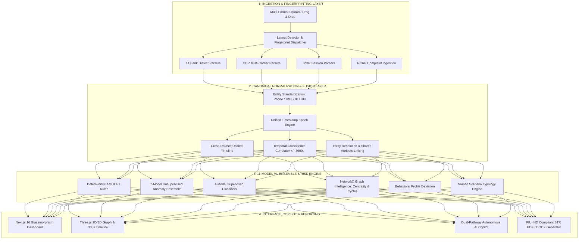

# Tri-Netra Forensics — System Architecture Blueprint

## Overview

Tri-Netra Forensics is an enterprise-grade cyber-forensic investigation platform designed to ingest, normalize, correlate, and analyze high-volume heterogeneous datasets across three critical domains:
1. **Financial Transactions** (Bank statements, Passbooks, CSV, XLSX, PDF)
2. **Telecommunications** (Call Detail Records — CDR from Airtel, Jio, Vi, SDR)
3. **Internet Data Activity** (IP Detail Records — IPDR session logs, IMEI, IMSI)
4. **Law Enforcement Intelligence** (NCRP cyber-crime portal complaint ledgers)

---

## 🏗️ High-Level Architectural Layers

---

## ⚡ Component Breakdown

### 1. Ingestion & Fingerprinting Pipeline
- **Auto-Detection (`backend/detect/`)**: Fingerprints files by inspecting token structures, regex matches, and header lines to automatically choose the correct parser without manual tagging.
- **Bank Parsers (`backend/parsers/bank.py`, `backend/parsers_bank.py`)**: Uses `pdfplumber` for geometric layout PDF parsing, handling multi-column tables, line wrapping, and balance-direction inference.
- **Telecom Parsers (`backend/parsers/cdr.py`, `backend/parsers/ipdr.py`)**: Standardizes telecom dumps across Airtel, Jio, Vi, and SDR formats.

### 2. Normalization & Fusion Core
- **Schema Unification (`backend/schema.py`)**: Transforms records into canonical models (`BANK_COLUMNS`, `CDR_COLUMNS`, `IPDR_COLUMNS`, `COMPLAINT_COLUMNS`).
- **Entity Linking (`backend/normalise.py`)**: Extracts UPI handles, phone numbers, and bank account numbers from free-text transaction descriptions.
- **Fusion Engine (`backend/fusion.py`)**: Merges financial credits/debits with voice/SMS events and IPDR sessions on a synchronized chronological timeline.

### 3. ML Risk & Scenario Engine
- **Hybrid Orchestrator (`backend/risk/hybrid.py`)**: Combines rule-based weights, unsupervised ML anomaly scores, temporal spikes, and graph centrality into calibrated 0–100 risk scores.
- **11-Model Ensemble (`backend/risk/ensemble.py`)**:
  - *Unsupervised*: Isolation Forest, Local Outlier Factor (LOF), DBSCAN, HDBSCAN, One-Class SVM, PCA Reconstruction, Z-Score.
  - *Supervised*: Random Forest, XGBoost, LightGBM, CatBoost.
- **Typology Classifiers (`backend/risk/scenarios.py`)**: Classifies money laundering typologies: *Rapid In-Out, Structuring, Smurfing, Layering, Circular Flow, Money Mule, Call-Assisted Fraud, SIM Swap, Device Change*.

### 4. Autonomous Copilot & RAG
- **Dual-Pathway NLQ (`investigative_copilot/`)**:
  - *Deterministic Fast-Path*: Instant entity lookup for IDs, accounts, phone numbers, and IMEIs.
  - *Grounded SQL Pathway*: LLM translates natural language queries (English/Hindi/Gujarati) into read-only SQL queries executed against an in-memory SQLite replica.
- **3D Semantic Reasoning Tree**: Visualizes LLM investigative pathways in interactive 3D WebGL space.

### 5. FIU-IND Suspicious Transaction Reporting (STR)
- **STR Case Builder (`backend/str_engine.py`)**: Compiles transaction context, counterparty analysis, funds flow, behavioral baselines, telecom links, and red flags.
- **PDF & DOCX Renderers (`backend/report.py`)**: Generates court-admissible legal dossiers and official FIU-IND STR forms with automated narrative synthesis.

---

## 🔒 Security & Privacy Architecture
- **Read-Only SQL Sandbox**: Database queries from the LLM are strictly sandboxed with read-only execution; data-modifying SQL is rejected.
- **Prompt Injection Defense**: Multi-stage prompt fences treat all raw evidence strings strictly as data objects.
- **Session Isolation**: User sessions and in-memory caches are isolated per authenticated JWT identity.
