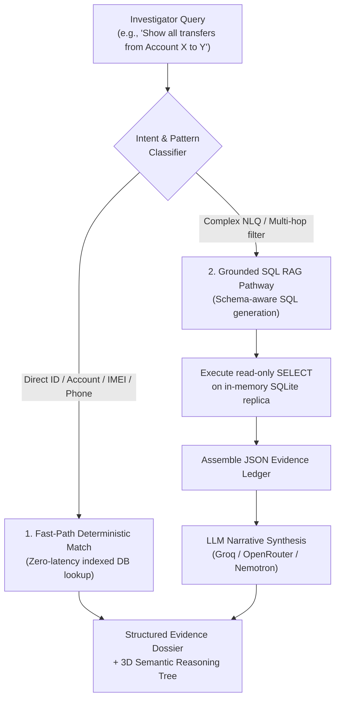

# Autonomous Investigative Copilot & RAG Engine

The Investigative Copilot (`investigative_copilot/`) is an autonomous, Grounded RAG (Retrieval-Augmented Generation) assistant that empowers cyber-crime investigators to query fused case evidence using natural language in English, Hindi, or Gujarati.

---

## 1. Dual-Pathway Query Execution

1. **Deterministic Fast-Path**: Direct regex resolution for transaction IDs (`TXN...`), bank account numbers, phone numbers (`+91...`), and IMEIs (`35...`, `86...`). Bypasses LLM latency for instant (<50ms) evidence retrieval.
2. **Grounded SQL RAG Pathway**: Translates complex, conversational queries into sandboxed, read-only SQL queries executed against an in-memory SQLite replica of the case bundle.

---

## 2. Multi-Provider LLM Resilience & Key Rotation

The Copilot features production-grade key rotation and multi-model fallback across **Groq** and **OpenRouter**:
- **Supported Models**:
  - `llama-3.3-70b-versatile` (Primary high-speed Groq engine)
  - `qwen-2.5-32b` / `qwen/qwen3.6-27b` (High-reasoning telecom/forensic fallback)
  - `deepseek-r1-distill-llama-70b` (Deep analytical reasoning)
  - `nvidia/nemotron-70b` (OpenRouter Grounded RAG)
- **Automatic Key Rotation**: Loads multiple API keys (`GROQ_API_KEY_1`, `GROQ_API_KEY_2`, ..., `OPEN_ROUTER_KEY_1`, etc.) from `backend/.env`, cycling through them sequentially to prevent rate limits.
- **Failover**: If a key receives an HTTP 429 or rate limit, the system instantly retries with the next key and fallback model.

---

## 3. Zero-Hallucination Evidence Grounding

The Copilot operates under strict system prompt constraints (`investigative_copilot/prompts.py`):
- **Strict Evidence Fencing**: Answers are strictly generated from the retrieved SQLite rows.
- **Explicit Negative Handling**: If an entity or transaction does not exist in the database, the Copilot clearly states that no matching records were found, rather than inventing false counterparties.
- **Security Injection Defense**: Rejects jailbreak attempts and treats malicious transaction narration strings strictly as immutable data.

---

## 4. 3D Semantic Graph & Visual Tree (USP)

When answering complex investigations, the Copilot dynamically generates a hierarchical semantic tree:
- **Interactive 3D WebGL Rendering**: Displayed in the UI using Three.js and React Flow.
- **Investigative Hierarchy**: Visualizes Master Case $\to$ Target Entity $\to$ Behavioral Anomaly Branches $\to$ Corroborating Telecom & Financial Evidence Nodes.
