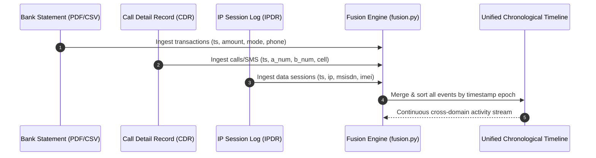

# Cross-Dataset Fusion Engine

The Cross-Dataset Fusion Engine (`backend/fusion.py`) correlates disparate data streams across financial, telecom, and internet access logs onto a synchronized event timeline and builds unified entity profiles.

---

## 1. Unified Chronological Event Timeline
The fusion engine constructs a single, unified, time-ordered sequence of events:
- **Financial Credits / Debits**: Extracted from bank statements with timestamp, amount, direction (`CR`/`DR`), mode (`UPI`, `IMPS`, `NEFT`, `RTGS`, `ATM`, `CASH`), counterparties, and narration.
- **Telecom Voice & SMS Activity**: Extracted from CDR logs with A-Party, B-Party, call type, duration, and cell tower coordinates.
- **Internet Data Sessions**: Extracted from IPDR logs with MSISDN, IP addresses, ports, and data volume bytes.

---

## 2. Multi-Domain Entity Linkage
The system links previously disconnected records across domains using shared deterministic identifiers:
$$\text{Bank Account} \longleftrightarrow \text{Phone (Beneficiary / Narration)} \longleftrightarrow \text{CDR A/B Party} \longleftrightarrow \text{IMEI / IMSI} \longleftrightarrow \text{IPDR Session IP}$$

- **UPI / Beneficiary Matching**: Extracts phone numbers embedded in bank narration strings (e.g. `UPI/P2A/123456/Rahul/9876543210@paytm`) and links them directly to CDR subscriber numbers.
- **Shared Hardware Footprints**: Links bank accounts whose IP sessions or mobile banking logins share the same IMEI/IMSI devices or source IP subnets.

---

## 3. Temporal Coincidence & Call-Assisted Fraud Detection
A decisive signature of cyber-fraud (social engineering, OTP phishing, tech support scams, electricity bill fraud) is a voice call occurring immediately prior to a fund transfer.

- **Sliding Coincidence Window**: The engine scans a configurable temporal window ($\pm 3600\text{s}$ default, configurable down to $\pm 600\text{s}$).
- **Coincidence Scoring**: Correlates transactions against active CDR records for the involved parties. If a call occurs within the window, the transaction is tagged with `Call Assisted Fraud` and elevated in the risk matrix.

---

## 4. Graph & Flow Intelligence Integration
The fusion layer computes:
- **Circular Flows**: Detects closed-loop fund movements ($A \to B \to C \to A$) that artificially inflate turnover or obscure fund origin.
- **Rapid In-and-Out**: Flags accounts receiving large sums that are dissipated or withdrawn within minutes.
- **Fraud Heat Maps**: Computes composite risk heat across accounts, phone numbers, and UPI handles, incorporating NCRP cyber-crime complaint history.
